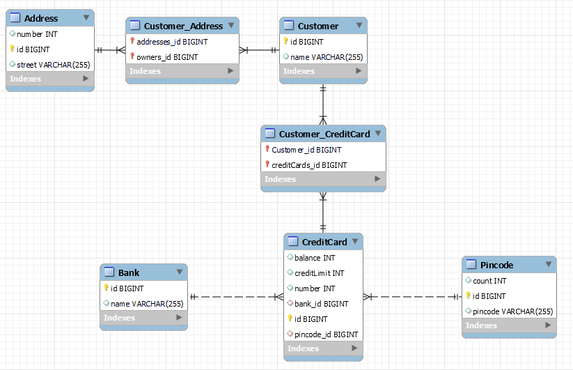

## Laboratory report

#### > technical problems that you encountered during installation and use of Java Persistence Architecture (JPA) and how you resolved
I had some issues with the tests at first because the tests expected the ManyToMany objects to be Sets and not Collection. After changing the type definition it all worked, and it was smooth sailing from there.

#### > a link to your code for experiment 2 above. Make sure the included test case passes!
[DAT250 source code](dat250expass2)

#### > an explanation of how you inspected the database tables and what tables were created. For the latter, you may provide screenshots.
I changed the database connection to use my own instance of MySQL that I had running in a docker container. I enabled auto-generation of the tables and ran the program. After it had finished, I opened up the database in MySQL Workbench and reverse engineered the tables to get a nice EER diagram.

#### > any pending issues with this assignment that you did not manage to solve
Solved all of them.