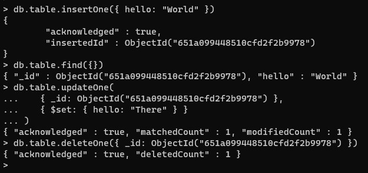
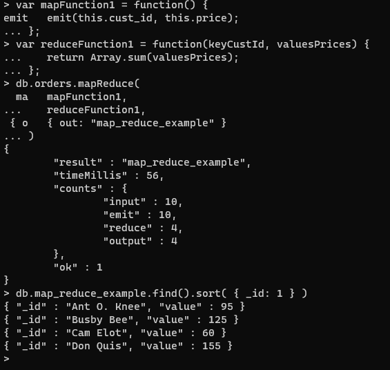
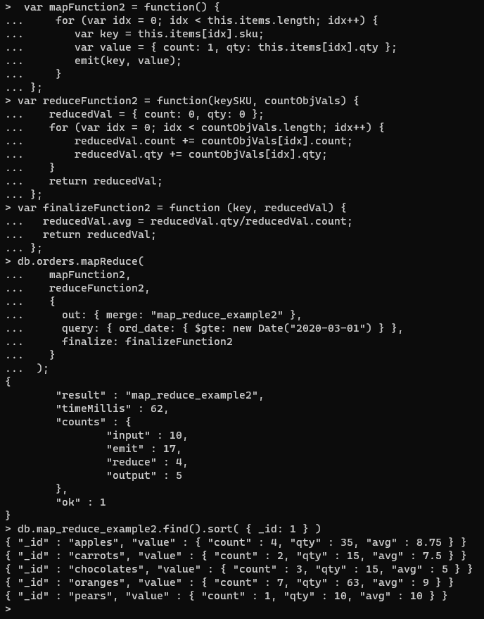
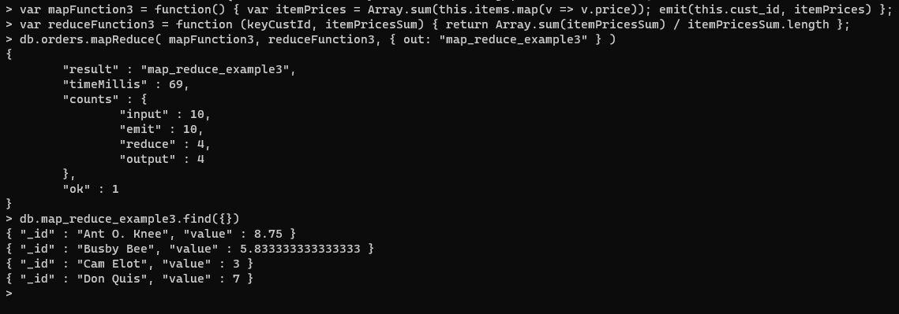

## Laboratory report

#### > technical problems that you encountered during installation and use of MongoDB and how you resolved
No issues

#### > package validation
I started by running the command

```sh
curl -fsSL https://pgp.mongodb.com/server-4.4.asc | sudo gpg -o /usr/share/keyrings/mongodb-server-4.4.gpg --dearmor
```

This installed a GPG key that I will use later to verify the authenticity of the packages I will install. Next I added the repository to my sources list with the following command.

```sh
echo "deb [ arch=amd64,arm64 signed-by=/usr/share/keyrings/mongodb-server-4.4.gpg ] https://repo.mongodb.org/apt/ubuntu focal/mongodb-org/4.4 multiverse" | sudo tee /etc/apt/sources.list.d/mongodb-org-4.4.list
```

Here the GPG key is used to verify the authenticity of the packages. Next I updated the local package database with the following command.

```sh
sudo apt-get update
```

This will update the local package database with the packages from the newly added repository. Next I installed the MongoDB packages with the following command.

```sh
sudo apt-get install -y mongodb-org=4.4.24 mongodb-org-server=4.4.24 mongodb-org-shell=4.4.24 mongodb-org-mongos=4.4.24 mongodb-org-tools=4.4.24
```

This will install the MongoDB packages, and the process is done safely.

### > Example 1 results (CRUD)


### > Example 2 results (Map Reduce)




This is my own map reduce function. It maps out the sum of the item prices, then divides it by the number of rows in the collection.


#### > reason about why your implemented Map-reduce operation in Experiment 2 is useful and interpret the collection obtained.
My function first finds the sum of all the item prices within each row. Then in the reduction phase, it will divide the sum by the number of rows in the collection. This will not give the average of the sum for each row, but instead a number that scales down as the number of items in the collection grows. This is useful if you want to find the average price of all the items in the collection, and not the average price of each row.

#### > any pending issues with this assignment which you did not manage to solve.
Solved all of them.
